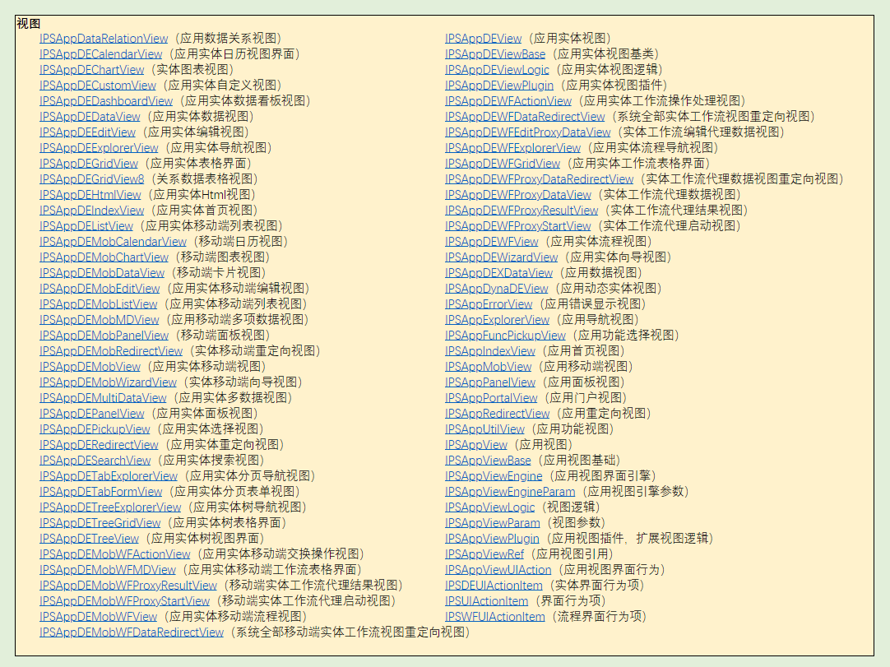

# 应用程序结构模型

在常规的应用程序由多个部分组成，将一个应用通过不同的功能结构化拆解，会发现应用主要有基本应用组织、提供界面表现的视图、提供数据获取的数据服务和元数据等几个部分组成。

结构化应用程序的意义，在于开发人员对应用的构成，有一个清晰明了的定义，明确基于程序文件的那一部分，定了什么样的功能，在应用程序中，处于何种定位，方便开发人员理解和参与内容优化。

应用程序，结构如下：

## 应用组织

应用组织，在应用程序中，为其提供应用级功能性内容，成员如下：

- 主题：提供应用级样式，应用程序可以切换不同样式，通过主题切换，为界面提供不同的样式展现。
- 多语言：多语言是前端必备的功能点，面向多样化的用户场景。
- 资源：应用内图片、图标等资源文件。
- 数据字典：数据信息的集合。

组织模型化支持如下表：

| 应用组织 | 模型名称     | 详情                                                         |
| -------- | ------------ | ------------------------------------------------------------ |
| 主题     | 应用界面主题 | [IPSAppUITheme](https://modelapi.ibizlab.cn/#/net/ibizsys/model/app/theme/IPSAppUITheme) |
| 多语言   | 应用多语言   | [IPSAppLan](https://modelapi.ibizlab.cn/#/net/ibizsys/model/app/IPSAppLan) |
| 资源     | 系统图片资源 | [IPSSysImage](https://modelapi.ibizlab.cn/#/net/ibizsys/model/res/IPSSysImage) |
| 数据字典 | 系统代码表   | [IPSCodeList](https://modelapi.ibizlab.cn/#/net/ibizsys/model/codelist/IPSCodeList) |
| 、、、   | 、、、       | 、、、                                                       |

## 视图

视图是应用程序的内容单位，通过一系列操纵，切换不同的视图，呈现不同的内容。不同的视图内容，可以通过不同的模型来构建处理。

在视图模型，不同的原因场景，将由不同的视图模型来处理，如表格视图、表单视图，都是因为具有不同的数据表现模型，所必须采用的模型结构。

现已支持的模型化视图类型如下：

查看详情，[请点击](https://modelapi.ibizlab.cn/doc/model/model.htm)。

### 视图结构

视图是 app 的主要表现内容，在应用程序中，内容的构成与业务的呈现，都由视图承载。

- 视图模型：视图数据模型和展现逻辑
- 视图消息：视图内容补充
- 布局：视图内容结构化处理
- 逻辑：系统逻辑在视图上的承载点
- 部件：业务数据的不同抽象结构
  - 部件成员：构建部件的内容
  - 部件消息：部件静态消息和动态消息
  - 逻辑：部件作为逻辑的承载点

视图模型结构如下表：

| 构成     | 模型名称     | 详情                                                         |
| -------- | ------------ | ------------------------------------------------------------ |
| 视图消息 | 视图消息     | [ IPSViewMsg](https://modelapi.ibizlab.cn/#/net/ibizsys/model/view/IPSViewMsg) |
| 布局     | 视图布局面板 | [ IPSViewLayoutPanel](https://modelapi.ibizlab.cn/#/net/ibizsys/model/control/panel/IPSViewLayoutPanel) |

### 逻辑

在应用中，逻辑属于界面表现的核心部分，它是基于数据为目标、交互为过程的一系列行为。逻辑本身补足了静态界面在展现方面的缺点，带有业务的逻辑，更是大大丰富了界面的能力。

根据不同的使用常见和提供的功能，将逻辑分为多种，如下表：

| 模型名称         | 详情                                                         |
| ---------------- | ------------------------------------------------------------ |
| 系统逻辑         | [ IPSSysLogic](https://modelapi.ibizlab.cn/#/net/ibizsys/model/res/IPSSysLogic) |
| 系统预置视图逻辑 | [IPSSysViewLogic](https://modelapi.ibizlab.cn/#/net/ibizsys/model/res/IPSSysViewLogic) |
| 界面逻辑         | [ IPSViewLogic](https://modelapi.ibizlab.cn/#/net/ibizsys/model/view/IPSViewLogic) |
| 实体逻辑         | [ IPSDELogic](https://modelapi.ibizlab.cn/#/net/ibizsys/model/dataentity/logic/IPSDELogic) |
| 实体逻辑行为     | [ IPSDELogicAction](https://modelapi.ibizlab.cn/#/net/ibizsys/model/dataentity/action/IPSDELogicAction) |
| 应用部件逻辑     | [ IPSControlLogic](https://modelapi.ibizlab.cn/#/net/ibizsys/model/control/IPSControlLogic) |
| 、、、           | 、、、                                                       |

逻辑根据不同的应用场景，处理了功能。

示例

### 部件

在视图中，部件是视图内容数据表现最丰富的部分。数据的表现形式的不同，将其抽象成不同的业务对象，常见的有表单、表格、树、图表和日历等。

常见的部件及模型如下：

| 部件   | 模型名称       | 详情                                                         |
| ------ | -------------- | ------------------------------------------------------------ |
| 表格   | 实体表格       | [ IPSDEGrid](https://modelapi.ibizlab.cn/#/net/ibizsys/model/control/grid/IPSDEGrid) |
| 表单   | 实体表单       | [ IPSDEForm](https://modelapi.ibizlab.cn/#/net/ibizsys/model/control/form/IPSDEForm) |
| 树     | 实体树视图部件 | [ IPSDETree](https://modelapi.ibizlab.cn/#/net/ibizsys/model/control/tree/IPSDETree) |
| 菜单   | 应用菜单       | [ IPSAppMenu](https://modelapi.ibizlab.cn/#/net/ibizsys/model/control/menu/IPSAppMenu) |
| 图表   | 实体图表控件   | [ IPSDEChart](https://modelapi.ibizlab.cn/#/net/ibizsys/model/control/chart/IPSDEChart) |
| 日历   | 日历部件       | [ IPSCalendar](https://modelapi.ibizlab.cn/#/net/ibizsys/model/control/calendar/IPSCalendar) |
| 向导   | 实体向导面板   | [IPSDEWizardPanel](https://modelapi.ibizlab.cn/#/net/ibizsys/model/control/wizardpanel/IPSDEWizardPanel) |
| 列表   | 实体列表控件   | [IPSDEList](https://modelapi.ibizlab.cn/#/net/ibizsys/model/control/list/IPSDEList) |
| 、、、 | 、、、         | 、、、                                                       |

部件的组成，主要包括部件成员、部件消息和逻辑等。逻辑的结构，和视图基本一致，此处不做介绍。

#### 部件消息

部件消息一般分为静态消息和动态消息两个部分，静态消息固定在部件的内容中，部件渲染，直接出现。动态消息一般在部件做逻辑交互时，做提示使用，丰富部件的业务逻辑交互效果。同时，部件消息提供多语言支持。

部件消息模型如下：

| 模型名称 | 详情                                                         |
| -------- | ------------------------------------------------------------ |
| 部件消息 | [ IPSCtrlMsg](https://modelapi.ibizlab.cn/#/net/ibizsys/model/res/IPSCtrlMsg) |

#### 部件成员

部件成员，是部件的组成

## 数据服务

数据服务，属于应用中业务能力抽象处理的中间层。常见的由公共 API 管理对象，提供部分逻辑处理，为界面提供数据。

提供数据服务方式及特点如下：

- 远程：通过 http 请求获取数据，具有前台与后台的交互过程，在处理请求时，同时提供其他功能。
  - 权限：请求过程动态授权。
  - API：公共的 API 管理。
  - 数据格式化：将获取的数据格式化处。
  - 多维数据约束：使用数据关系能力约束。
- 本地：在浏览器中获取数据。
  - 缓存：从浏览器中获取数据，解析获取所需部分。
  - 数据库：从浏览器数据库中读取数据。

数据服务在现有的技术框架中，Angular 的服务对象，基本能合适的匹配数据服务功能。该框架中的服务对象，对每个组件提供服务能力，其中有数据获取、API 维护和数据格式化等常见功能。

本文示例如下：

在上述代码示例中，基于数据关系的能力，在 URL 中通过层级访问路径得以体现。数据对象的主键作为约束能力的部分内容，成为了权限和多维数据约束在实际应用中的具体场景。

## 元数据

 元数据是关于数据的组织、数据域及其关系的信息，简言之，元数据就是关于数据的数据。

其成员如下：

- 元素：数据成员，构成元数据的基本组成的单位。
- 元素值规则：元素基本类别，如文本、时间、数值等，另外提供复杂值规则，如正则、值范围等等。
- 数据模型：提供的数据结构。
- 数据关系：对象之间的主从关系，表现为数据之间的约束。
- Mock 数据：模拟真实业务数据。

元数据在应用程序中，是基于业务表现的一种数据处理结果。