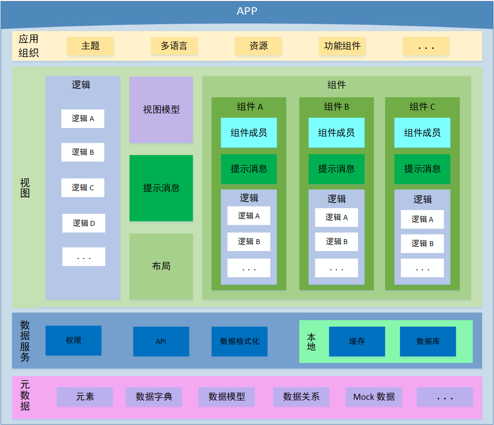

# 应用程序结构模型

在常规的应用程序（以下简称 app）由多个部分组成，将一个 app 根据不同的功能做结构化拆解，发现应用的主要组成有应用组织、视图、数据服务和元数据等几个部分组成。

结构化应用程序的意义，在于开发人员对应用的构成，有一个清晰明了的定义，明确基于程序文件的那一部分，定了什么样的功能，在应用程序中，处于何种定位，方便开发人员理解和参与内容优化。

应用程序，结构如下：

## 应用组织

应用组织，在 app 中，为其提供应用级功能性内容，成员如下：

- 主题：提供应用级样式，应用程序可以切换不同样式，通过主题切换，为界面提供不同的样式展现。
- 多语言：多语言是前端必备的功能点，面向多样化的用户场景。
- 资源：app 内图片、图标等资源文件。
- 功能组件：登录页面、注销页面、404 页面、 500 页面等功能组件，该组件一般不会复用。

应用组织的内容，多为 app 所必须的结构，补充 app 所能提供的功能。

IBiz 前端模型，在适配应用组织成员上，做了比较多的结构设计，可以为 app 构建对于的应用组织成员。

组织模型化支持如下表：

| 应用组织 | 模型名称     | 详情                                                         | 备注    |
| -------- | ------------ | ------------------------------------------------------------ | ------- |
| 主题     | 应用界面主题 | [IPSAppUITheme](https://modelapi.ibizlab.cn/#/net/ibizsys/model/app/theme/IPSAppUITheme) |         |
| 多语言   | 应用多语言   | [IPSAppLan](https://modelapi.ibizlab.cn/#/net/ibizsys/model/app/IPSAppLan) |         |
| 资源     | 系统图片资源 | [IPSSysImage](https://modelapi.ibizlab.cn/#/net/ibizsys/model/res/IPSSysImage) |         |
| 功能组件 | 应用功能页面 | [ IPSAppUtilPage](https://modelapi.ibizlab.cn/#/net/ibizsys/model/app/IPSAppUtilPage) |         |
| . . .    | .  .  .      | .  .  .                                                      | .  .  . |

应用界面主题模型，应该包含一整套的模型内容，主题所需的必备点在模型中，应该做关系约束比较好，有需要可以做模型补充，约束结构如下所示：

## 视图

视图时 app 的内容单位，视图本身属于组件的一种。

视图组为独立的功能结构来做说明，是因为视图本都属于 app 业务结构的抽象集合。一个视图，就是一个完整业务能力在 app 中的表现，app 通过不同的视图，展示不同业务需要，构建可以重复使用的内容单位。

文本将功能组件与视图做出区别，就在于组件是否被基于业务重复使用。功能组件一般只有特定条件才会被 app 访问，视图则会在整个 app 会被重复使用。

视图成员如下：

- 逻辑：视图拥有的数据处理代码结构。

- 视图模型：视图数据模型。
- 提示消息：视图提示消息，一般放置静态的 Alert 类提示信息。
- 布局：视图内容布局，将组件在不同的位置展示。
- 组件：视图业务数据的抽象单位。
  - 组件成员：部分组件会实现更加细化的抽象结构，如表单中的数据编辑对象。
  - 提示消息：组件提示消息，一般分为静态和动态。静态消息和视图消息类似，动态消息主要为组件数据加载、处理后的提示信息。
  - 逻辑：部分组件除了数据加载逻辑之外，会附加其他处理，如删除、编辑等，常见于表格或者列表中。

IBiz 前端模型，针对视图提供了 [应用视图模型（IPSAppView）]( https://modelapi.ibizlab.cn/#/net/ibizsys/model/app/view/IPSAppView ) ，该视图模型为常规视图提供所需的视图布局、逻辑等一系列内容，以下几个结构以 应用视图模型适配视图成员做出说明。

### 逻辑

> 注：本章节中提到的部件，将在组件章节做出介绍。

逻辑作为交互功能的代码单位，在视图中有非常重要的地位。它是视图业务的表现，也是数据处理的重要环节。

iBiz 前端模型中，逻辑模型本身是中立的，它并不针对场景设计逻辑模型。一般是定义好模型之后，将模型挂载到视图上，模型落地即成为视图模型；将模型挂载到部件上，模型落地即成为部件模型。

除了基于视图交互所定义的模型之外，iBiz 前端模型还预置引擎逻辑，数据校验等其他的逻辑模型。

IBiz 前端现有的模型能力，基本能适配常见的视图逻辑内容，详情如下：

| 模型名称             | 详情                                                         | 备注    |
| -------------------- | ------------------------------------------------------------ | ------- |
| 界面行为             | [ IPSUIAction](https://modelapi.ibizlab.cn/#/net/ibizsys/model/view/IPSUIAction) |         |
| 应用视图逻辑         | [IPSAppViewLogic](https://modelapi.ibizlab.cn/#/net/ibizsys/model/app/view/IPSAppViewLogic) |         |
| 应用视图逻辑引用视图 | [ IPSAppViewLogicRefView](https://modelapi.ibizlab.cn/#/net/ibizsys/model/app/view/logic/IPSAppViewLogicRefView) |         |
| 应用视图新建数据逻辑 | [ IPSAppViewNewDataLogic](https://modelapi.ibizlab.cn/#/net/ibizsys/model/app/view/logic/IPSAppViewNewDataLogic) |         |
| 实体打开数据视图逻辑 | [ IPSAppViewOpenDataLogic](https://modelapi.ibizlab.cn/#/net/ibizsys/model/app/view/logic/IPSAppViewOpenDataLogic) |         |
| 应用部件逻辑         | [ IPSControlLogic](https://modelapi.ibizlab.cn/#/net/ibizsys/model/control/IPSControlLogic) |         |
| 系统内置视图引擎     | [IPSViewEngine](https://modelapi.ibizlab.cn/#/net/ibizsys/model/view/IPSViewEngine) |         |
| .  .  .              | .  .  .                                                      | .  .  . |

IBiz 逻辑模型在 app 上的交互结构，可以从下图说明：

逻辑在视图和部件内部，本身具有完整的处理逻辑，作为载体，逻辑在其内部是封闭的。

同时，视图和部件，也可以通过逻辑进行交互，它是二者数据流向的的通道。

### 视图模型

视图模型是由前端开发人员组织生成和维护的视图数据层。 

IBiz 应用视图模型中，并没有提供相应的视图模型对象，给需要使用的 app 程序直接消费。但是，应用视图模型本身具备有视图模型所需变量，模型使用人员可以通过应用视图模型构建前端所需视图模型内容。

### 提示消息

提示消息，是视图丰富业务说明必不可少的一部分。

在视图中，数据的展现，总是单一而枯燥的，视图消息补充了这部分说明。对 app 而言，基于数据在视图中的业务逻辑更加规范，使用的方便都大大提高。

IBiz 应用视图模型中，适配了提示消息，模型名称为视图消息，并由多种应用场景。其中，包括视图消息位置、视图消息模式（动态和静态）和根据用户权限动态获取视图消息等。

视图消息模型，对于日常的提示消息使用而言，已经适配了常规场景使用模式。

模型如下：

| 模型名称             | 详情                                                         | 备注 |
| -------------------- | ------------------------------------------------------------ | ---- |
| 视图消息             | [ IPSViewMsg](https://modelapi.ibizlab.cn/#/net/ibizsys/model/view/IPSViewMsg) |      |
| 视图消息组           | [ IPSViewMsgGroup](https://modelapi.ibizlab.cn/#/net/ibizsys/model/view/IPSViewMsgGroup) |      |
| 视图消息组成员       | [ IPSViewMsgGroupDetail](https://modelapi.ibizlab.cn/#/net/ibizsys/model/view/IPSViewMsgGroupDetail) |      |
| 实体数据集合视图消息 | [ IPSDEDataSetViewMsg](https://modelapi.ibizlab.cn/#/net/ibizsys/model/view/IPSDEDataSetViewMsg) |      |

### 布局

在视图中，布局作用是比较明显的，简单的说明，就是视图的那个位置放置什么样合适的内容。

app  开发时，一般是事先设计好对于的原型图，然后通过代码实现，后期需要调整，开发人员也是通过代码能力调整，适配相应的业务需求。

基于 iBiz 应用视图模型的开发中，同样具备开发人员使用代码调整的方式，该方式对于任何技术人员的要求，都是一致的。

同时，iBiz 提供视图布局面板模型给开发人员和业务人员使用，它通过定义内容的放置位置，动态的发布文件布局内容，完成布局的功能。

模型如下：

| 模型名称     | 详情                                                         | 备注    |
| ------------ | ------------------------------------------------------------ | ------- |
| 布局面板     | [ IPSLayoutPanel](https://modelapi.ibizlab.cn/#/net/ibizsys/model/control/panel/IPSLayoutPanel) |         |
| 视图布局面板 | [ IPSViewLayoutPanel](https://modelapi.ibizlab.cn/#/net/ibizsys/model/control/panel/IPSViewLayoutPanel) |         |
| .  .  .      | .  .  .                                                      | .  .  . |

> 注：该布局模式，同时适配部件。

### 组件

组件， 是数据和方法的简单封装。一般而言，组件是 app 中内容的最小表达单位，属于业务的抽象对象，具有多次复用的能力。

在 iBiz 的前端模型中，并没有定义组件的概念，而是抽象了更深层次的模型化对象部件。部件具备了组件的基本能力，同时具有更大程度的数据交互和内容绘制能力。在本章节中，组件即为部件，我们主要介绍部件模型对象。

前端模型根据不同业务数据表现，将其抽象成不同的业务对象，常见的有表单、表格、树、图表和日历等.

模型如下：

| 部件    | 模型名称       | 详情                                                         | 备注    |
| ------- | -------------- | ------------------------------------------------------------ | ------- |
| 工具栏  | 实体工具栏控件 | [ IPSDEToolbar](https://modelapi.ibizlab.cn/#/net/ibizsys/model/control/toolbar/IPSDEToolbar) |         |
| 表格    | 实体表格       | [ IPSDEGrid](https://modelapi.ibizlab.cn/#/net/ibizsys/model/control/grid/IPSDEGrid) |         |
| 表单    | 实体表单       | [ IPSDEForm](https://modelapi.ibizlab.cn/#/net/ibizsys/model/control/form/IPSDEForm) |         |
| 树      | 实体树视图部件 | [ IPSDETree](https://modelapi.ibizlab.cn/#/net/ibizsys/model/control/tree/IPSDETree) |         |
| 菜单    | 应用菜单       | [ IPSAppMenu](https://modelapi.ibizlab.cn/#/net/ibizsys/model/control/menu/IPSAppMenu) |         |
| 图表    | 实体图表控件   | [ IPSDEChart](https://modelapi.ibizlab.cn/#/net/ibizsys/model/control/chart/IPSDEChart) |         |
| 日历    | 日历部件       | [ IPSCalendar](https://modelapi.ibizlab.cn/#/net/ibizsys/model/control/calendar/IPSCalendar) |         |
| 向导    | 实体向导面板   | [IPSDEWizardPanel](https://modelapi.ibizlab.cn/#/net/ibizsys/model/control/wizardpanel/IPSDEWizardPanel) |         |
| 列表    | 实体列表控件   | [IPSDEList](https://modelapi.ibizlab.cn/#/net/ibizsys/model/control/list/IPSDEList) |         |
| .  .  . | .  .  .        | .  .  .                                                      | .  .  . |

基于部件模型，可以构建不同的部件组合方式，以下图为例。

​                                                                                      图示1

​                                                                                      图示2

在上述两个图视中，分别向我们展示了基于业务模型需要，使用不同部件模型之间的组合，生成不同的部件内容。其中，使用了一个工具栏对象，在消费不同的模型业务，细化不同业务场景。

> 注：上述示例中，蓝色链接部分，是逻辑在组件内的使用方式，

#### 组件成员

在常规的开发中，组件成员比较少见。很多的开发人员，基本将所需的组件内容一次性构建完成，不做细化的处理。

但是，这样的方式对于局部功能相同的内容，没有办法复用，每个组件内容，都要维护对于的内容效果。对于批量的需求修改，不是一个恰当的方式。

#### 提示消息

提示消息，在组件中，同样提供相应的业务说明能力，也同样具有静态与动态的区别。与视图提示消息不一样的是，组件中的动态消息，一般是为组件方法逻辑提供。

组件方法逻辑，对数据做处理后，一般不同的提示效果。

IBiz 的前端模型适配了逻辑处理不同提示消息，在前端的交互效果上，填补了消息提示的单一性。

模型如下：

| 模型名称 | 详情                                                         | 备注 |
| -------- | ------------------------------------------------------------ | ---- |
| 部件消息 | [ IPSCtrlMsg](https://modelapi.ibizlab.cn/#/net/ibizsys/model/res/IPSCtrlMsg) |      |

#### 

#### 逻辑

逻辑在组件中，和逻辑在视图中，除场景模式之外，其他基本类似，此处不做更多介绍。

## 数据服务

数据服务，属于应用中业务能力抽象处理的中间层。

详情如下：

- 权限：权限是服务关键的一个部分，一般使用请求路径分级赋值授权。
- API：公共的 API 管理。
- 数据格式化：将获取的数据格式化处，一般为对象化处理。
- 本地：在浏览器中获取数据。
  - 缓存：从浏览器中获取数据，解析获取所需部分。
  - 数据库：从浏览器数据库中读取数据。

IBiz 的前端模型并不对数据服务提供直接的模型内容，数据服务是对数据模型结构定义对象的消费，该树模型结构对象被称之为[应用实体对象]( https://modelapi.ibizlab.cn/#/net/ibizsys/model/app/dataentity/IPSAppDataEntity ) 。应用实体对象本身，是一个中性的数据结构对象，该对象在被使用时，提供关于数据能力的模型内容，其中，数据服务就是其中的一个部分。

视图是应用实体对象的使用点，作为业务内容的直接表现对象，视图和视图的组成成员将直接使用应用实体对象的数据内容，应用实体对象也将提供合适实现方式，下文是一个数据服务实现的示例。

数据服务在现有的技术框架中，Angular 的服务对象，基本能合适的匹配数据服务功能。该框架中的服务对象，对每个组件提供服务能力，其中有数据获取、API 维护和数据格式化等常见功能。

代码结构示例如下：

在上述代码示例中，基于数据关系的能力，在 URL 中通过层级访问路径得以体现。数据对象的主键作为约束能力的部分内容，成为了权限和多维数据约束在实际应用中的具体场景。

## 元数据

 元数据是关于数据的组织、数据域及其关系的信息，简言之，元数据就是关于数据的数据。

其成员如下：

- 元素：数据成员，构成元数据的基本组成的单位。
- 数据字典： 数据信息的集合 。
- 数据模型：提供的数据结构。
- 数据关系：对象之间的主从关系，表现为数据之间的约束。
- Mock 数据：模拟真实业务数据。

元数据在应用程序中，是基于业务表现的一种数据处理结果。

如果说，数据服务是基于数据能力的具体实现，并因此使用了应用实体模型，那么元数据的模型对象，则是[系统实体](https://modelapi.ibizlab.cn/#/net/ibizsys/model/dataentity/IPSDataEntity)和[代码表](https://modelapi.ibizlab.cn/#/net/ibizsys/model/codelist/IPSCodeList)。两个元数据对象，都不直接对前端做模型内容提供，他们是 iBiz 模型最基础的数据结构定义。其中，数据字典的模型对象是代码表模型，元素、数据模型和数据关系等，则是元数据的模型提供者。